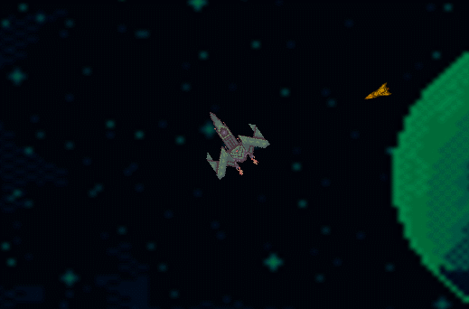
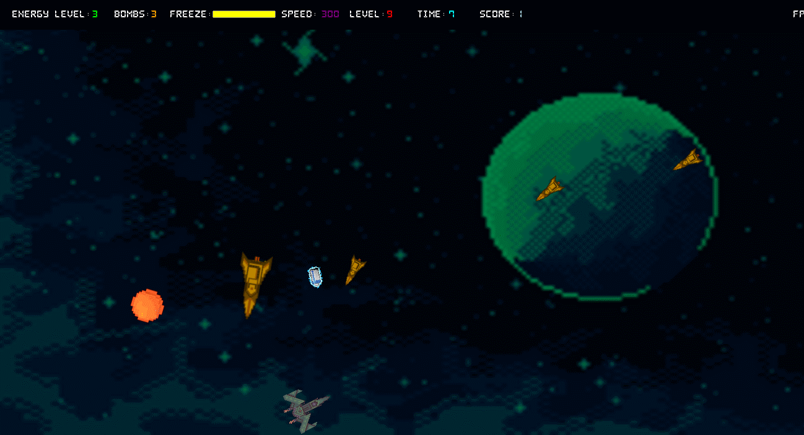
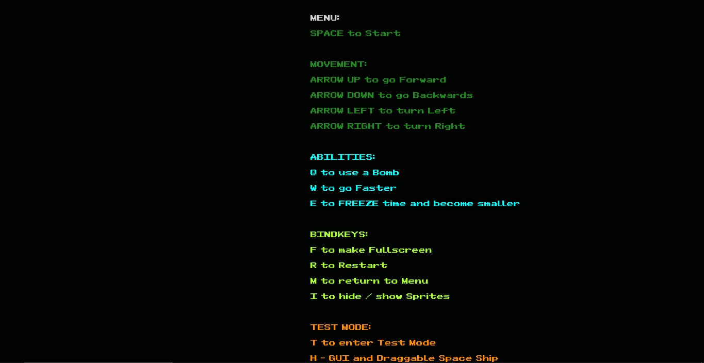

# TO START THE GAME:

1. Download this repositoriy
2. Run 2D.exe
3. Play

# Features

## Collision Detection

## Time Freeze

## Battery (collectable to restore shield energy/health)

## Bomb (collectable to destroy missiles)

## Main Menu

## Test Mode

## Other Features

* Music and sound effects
* Frame independency
* Advanced score system based on level and in-game time
* HUD and GUI for testing
* Acceleration on W key
* Bomb release on Q key
* Time Freeze on Q key
* Game Restart on R key
* Return to Menu on M key
* Test mode on T key
* GUI for test on H key
* Texsture removal on O key

